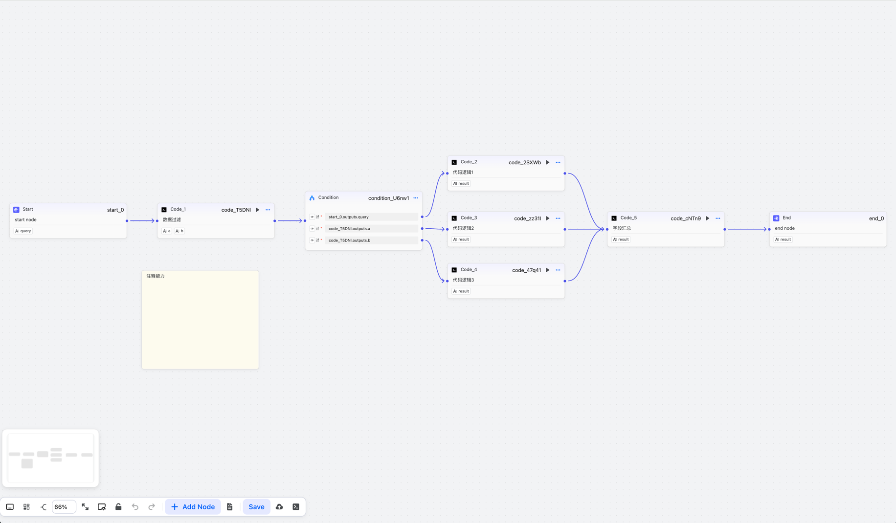

## flowgram-ai-rule-engine

### ① 项目定位

一个可视化的规则引擎前端画布程序，期望具备以下功能
1. 代码节点
2. 分支节点
3. 测试运行
4. 配套的java后端
5. 可以微前端或者web-components运行，进而支持跨前端语言 已实现 ruoyi-vue3-flowgram
效果如下：
集成ruoyi-vue3微前端示例：

工作流调用效果示例：

微前端demo示例：

### ② 为什么会基于flowgram.ai再次开源一个项目？

官方的demo-free-layout更新较慢，提PR再使用较慢，并且不适用于我的场景。

### ③ 功能介绍

vue3 微前端: demo-wujie-main-vue3，可以搭配后端启动

flowgram 示例: https://boommanpro.github.io/flowgram-ai-rule-engine/workflow-editor/

在官方版本的基础上实现以下功能

1. 新增code节点 已完成
2. 增加note节点，仿官方注释功能 已完成
3. 增加全局导入和导出功能 已完成
4. 新增单个节点支持增加注释和注释修改，节点名称修改功能 已完成
5. 增加单个节点的运行和导出节点内容功能 已完成
6. 优化组件变量能力 已完成
7. condition组件优化 已完成
   - 支持false功能
   - 支持left和right的表达式功能
   - 支持与和或的功能
8. 支持format-string节点，用于数据格式化 已完成
9. 支持java后端能力 已完成
10. 支持测试能力，并且记录测试入参
11. 加载中效果实现

服务端支持,项目地址：https://github.com/boommanpro/gaia-workflow

## 时间线
2025.10.17 跟进官网升级到v0.5.5，修复相关代码

2025.9.6 前后端支持string-format组件，支持spel、thymeleaf语法，当前支持与vue3打通，管理端使用vue3，工作流核心使用flowgram.ai

2025.8.22 服务端支持,项目地址：https://github.com/boommanpro/gaia-workflow

2025.8.20 更新分支到官网最新，重构代码分支

2025.5.27 重构代码分支，该代码仅维护apps/demo-free-layout目录，其余和官方保持一致

截图如下:

